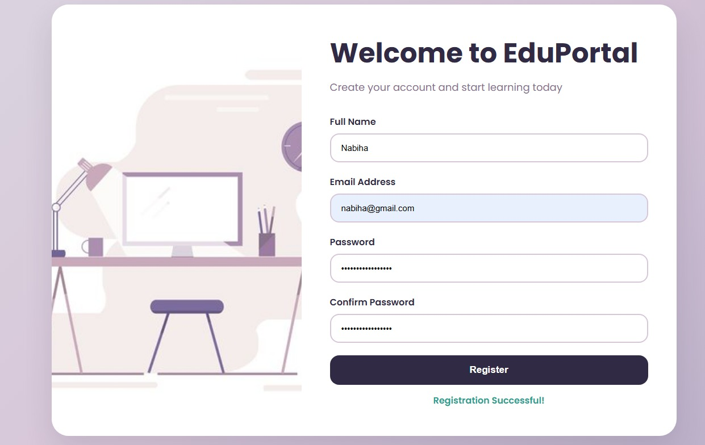

# EDUPORTAL – RESPONSIVE USER REGISTRATION FORM WITH CLIENT-SIDE VALIDATION

## 🎯 Live Demo Output
https://nabihaz2606.github.io/decodelabs_task4/

## 📸 Output Screen

The output screen displays a modern registration interface with:

- Registration illustration
- User registration form
- Input validation messages
- Success confirmation message
- Responsive layout

## 📖 Project Description

EduPortal is a modern and responsive User Registration Form developed using HTML, CSS, and JavaScript. The project focuses on creating an attractive user interface while implementing client-side validation to ensure accurate and secure user input.

The application features a professional split-screen layout with a registration illustration and an intuitive registration form. It validates user information before submission, providing real-time feedback through error and success messages. The project demonstrates essential frontend development concepts such as form handling, DOM manipulation, regular expressions (Regex), event handling, and responsive web design.

This project is designed to improve user experience by preventing invalid form submissions and ensuring data consistency through effective validation techniques.

The application allows users to enter:
- Full Name
- Email Address
- Password
- Confirm Password
  Validation Checks
✔ Full Name cannot be empty
✔ Email must follow a valid email format
✔ Password must contain:
- Minimum 8 characters
- At least one uppercase letter
- At least one lowercase letter
- At least one number
- At least one special character
✔ Confirm Password must match the Password field
Registration Successful!

## ✨ Features

- Modern and responsive user interface
- Split-screen registration layout
- User-friendly design with illustration support
- Client-side form validation
- Email validation using Regular Expressions (Regex)
- Strong password validation
- Confirm password verification
- Dynamic error message display
- Success message notification
- Interactive button hover effects
- Responsive design for mobile, tablet, and desktop devices
- Clean and maintainable code structure

## 🛠️ Technologies Used
Frontend Technologies
- HTML5
- CSS3
- JavaScript (ES6)

### Concepts Implemented

- Form Design
- Form Validation
- DOM Manipulation
- Event Handling
- Regular Expressions (Regex)
- Responsive Web Design
- CSS Flexbox
- Media Queries
- CSS Variables

## 📂 Project Structure

EduPortal/
│
├── images/
│   └── register-illustration.jpeg
│
├── index.html
├── style.css
├── script.js
└── README.md

## 🔄 Project Workflow

User Input
     ↓
Validation Process
     ↓
Error Detection
     ↓
Display Feedback
     ↓
Successful Registration

---

## 📱 Responsive Design

The application is fully responsive and optimized for:

- Desktop Computers
- Laptops
- Tablets
- Smartphones

The layout automatically adjusts to different screen sizes using CSS Media Queries.

## 🎓 Learning Outcomes

This project helped in understanding:

- HTML Form Elements
- CSS Layout Techniques
- JavaScript Validation Logic
- Regular Expressions (Regex)
- DOM Manipulation
- Event Handling
- Responsive Web Design Principles
- User Experience (UX) Design

## 👨‍💻 Author

**Nabiha**

Frontend Developer
